# DBS 302 - Practical 1 Laboratory Report

**Setting Up Redis, MongoDB, and Cassandra: Implementing a Social Media Data Model and Contrasting Query Patterns**

---

## Table of Contents

1. [Introduction](#1-introduction)
2. [Setup Evidence](#2-setup-evidence)
3. [Implementation](#3-implementation)
   - [Part A: Redis](#31-part-a-redis--key-value-social-media-model)
   - [Part B: MongoDB](#32-part-b-mongodb--document-social-media-model)
   - [Part C: Cassandra](#33-part-c-cassandra--column-family-social-media-model)
4. [Benchmark Results](#4-benchmark-results)
5. [Comparison Table](#5-comparison-table)
6. [Summary Analysis](#6-summary-analysis)
7. [References](#7-references)

---

## 1. Introduction

This laboratory report documents the setup, configuration, and practical exploration of three distinct NoSQL database systems: **Redis**, **MongoDB**, and **Apache Cassandra**. The practical was conducted as part of the DBS302 NoSQL Database Management module and aimed to demonstrate how the same conceptual data model — a social media platform — can be implemented differently across three NoSQL paradigms.

### 1.1 Overview of the Three Databases

**Redis** is an in-memory key-value store renowned for its exceptional speed. It stores data as key-value pairs where values can be Strings, Hashes, Lists, Sets, or Sorted Sets. Redis is primarily used for caching, session management, and real-time counters, delivering sub-millisecond read and write latency.

**MongoDB** is a document-oriented database that stores data as BSON (Binary JSON) documents grouped into collections. It supports flexible schemas, rich queries, and a powerful aggregation framework. MongoDB is well-suited for applications requiring complex, nested data structures and ad-hoc queries.

**Apache Cassandra** is a distributed column-family store designed for high write throughput and linear horizontal scalability. Unlike relational or document databases, Cassandra requires data to be modelled around specific query patterns. It is especially suited to write-heavy workloads at massive scale, such as event logging and pre-computed timelines.

| Database | NoSQL Category | Primary Strength | CAP Positioning |
|---|---|---|---|
| Redis | Key-Value Store | In-memory speed, caching, session storage | CP (configurable) |
| MongoDB | Document Store | Flexible schema, rich queries | CP (configurable) |
| Cassandra | Column-Family Store | Write-heavy workloads, linear scalability | AP (tunable) |

### 1.2 Purpose of the Practical

The central aim of this practical was to implement a social media data model — encompassing user profiles, posts, follower relationships, and news feeds — in each database, and to observe and contrast the different query patterns, data modelling philosophies, and performance characteristics that emerge. All three databases were deployed using Docker to ensure a consistent, isolated development environment.

---

## 2. Setup Evidence

### 2.1 Docker Installation Verification

Docker Desktop was installed and verified using the following terminal commands:

```bash
docker --version
docker compose version
```

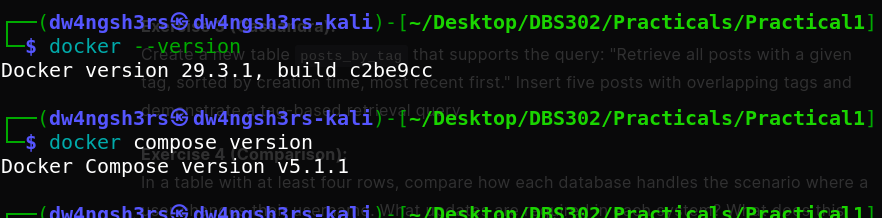


### 2.2 Docker Compose Configuration

A project directory `nosql-practical-1` was created and a `docker-compose.yml` file was configured to run all three database containers simultaneously. The file defines three services: `redis` (port 6379), `mongodb` (port 27017), and `cassandra` (port 9042), each with persistent named volumes.

```yaml
version: "3.9"

services:
  redis:
    image: redis:7.2
    container_name: redis_social
    ports:
      - "6379:6379"
    command: redis-server --save 60 1 --loglevel warning
    volumes:
      - redis_data:/data

  mongodb:
    image: mongo:7.0
    container_name: mongo_social
    ports:
      - "27017:27017"
    environment:
      MONGO_INITDB_ROOT_USERNAME: admin
      MONGO_INITDB_ROOT_PASSWORD: password123
    volumes:
      - mongo_data:/data/db

  cassandra:
    image: cassandra:4.1
    container_name: cassandra_social
    ports:
      - "9042:9042"
    environment:
      - CASSANDRA_CLUSTER_NAME=SocialCluster
      - CASSANDRA_DC=datacenter1
      - HEAP_NEWSIZE=128M
      - MAX_HEAP_SIZE=512M
    volumes:
      - cassandra_data:/var/lib/cassandra

volumes:
  redis_data:
  mongo_data:
  cassandra_data:
```

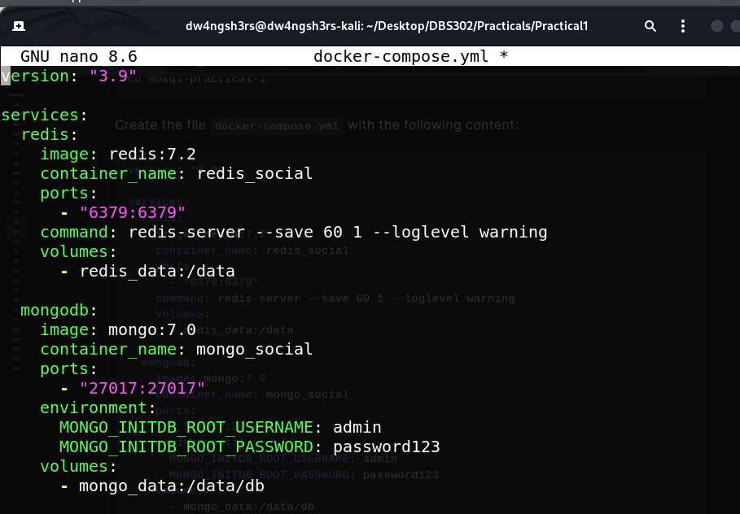

### 2.3 Containers Running

All three containers were started and verified:

```bash
docker compose up -d
docker compose ps
```


---

## 3. Implementation

### 3.1 Part A: Redis — Key-Value Social Media Model

#### 3.1.1 Connecting to Redis

Redis was accessed using the `redis-cli` interface inside the running Docker container:

```bash
docker exec -it redis_social redis-cli
```

```
127.0.0.1:6379> PING
PONG
```

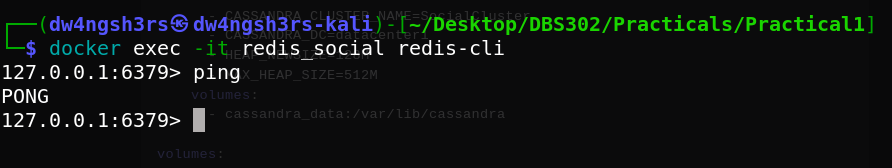

#### 3.1.2 Creating User Profiles (Hash)

Three user profiles were created using the `HSET` command, storing each user as a Hash under a namespaced key `user:{id}`:

```bash
HSET user:1001 username "alice" name "Alice Johnson" bio "Software engineer and coffee lover." joined "2024-01-15" followers_count 0 following_count 0

HSET user:1002 username "bob" name "Bob Smith" bio "Tech enthusiast and open-source contributor." joined "2024-02-20" followers_count 0 following_count 0

HSET user:1003 username "carol" name "Carol Williams" bio "Designer and digital artist." joined "2024-03-10" followers_count 0 following_count 0
```

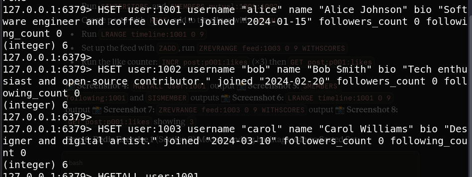

Alice's full profile was then retrieved:

```bash
HGETALL user:1001
```


#### 3.1.3 Modelling Follower Relationships (Set)

Follower and following relationships were modelled using Redis Sets. Alice follows Bob and Carol; Bob follows Carol:

```bash
-- Alice (1001) follows Bob (1002) and Carol (1003)
SADD following:1001 1002 1003
SADD followers:1002 1001
SADD followers:1003 1001

-- Bob (1002) follows Carol (1003)
SADD following:1002 1003
SADD followers:1003 1002

SMEMBERS following:1001
SISMEMBER following:1001 1002

SINTERSTORE mutual:1001:1002 following:1001 following:1002
SMEMBERS mutual:1001:1002

HINCRBY user:1001 following_count 2
HINCRBY user:1002 followers_count 1
HINCRBY user:1003 followers_count 2
```

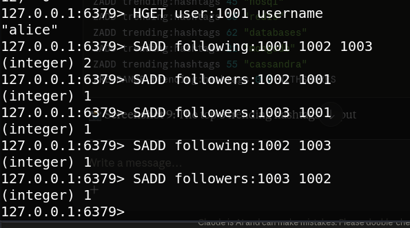


#### 3.1.4 Modelling Posts and Timelines (Hash + List)

Posts were stored as Hashes and user timelines were maintained as Lists, with `LPUSH` placing the most recent post at the front:

```bash
HSET post:p001 user_id 1001 content "Just set up my NoSQL development environment. Redis is incredibly fast!" timestamp "2025-05-01T10:00:00Z" likes 0
HSET post:p002 user_id 1001 content "MongoDB's document model makes data modeling so intuitive." timestamp "2025-05-01T11:30:00Z" likes 0
HSET post:p003 user_id 1002 content "Learning about CAP theorem today." timestamp "2025-05-01T09:00:00Z" likes 0

LPUSH timeline:1001 p001 p002
LPUSH timeline:1002 p003

LRANGE timeline:1001 0 9
```


#### 3.1.5 News Feed (Sorted Set) and Like Counter

Carol's news feed was modelled as a Sorted Set with Unix timestamps as scores, enabling chronological retrieval. Like counts were managed using atomic `INCR` operations:

```bash
ZADD feed:1003 1746345600 p001
ZADD feed:1003 1746352200 p002
ZADD feed:1003 1746338400 p003

ZREVRANGE feed:1003 0 9 WITHSCORES

INCR post:p001:likes
INCR post:p001:likes
INCR post:p001:likes
GET post:p001:likes
```

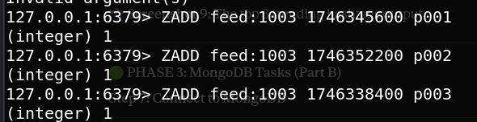


#### 3.1.6 Exercise 1 — Trending Hashtags (Sorted Set)

A Trending Hashtags feature was modelled using a Redis Sorted Set where each score represents the number of posts using that hashtag. Five hashtags were inserted and the top three were retrieved:

```bash
ZADD trending:hashtags 45 "nosql"
ZADD trending:hashtags 38 "redis"
ZADD trending:hashtags 62 "databases"
ZADD trending:hashtags 21 "mongodb"
ZADD trending:hashtags 55 "cassandra"

ZREVRANGE trending:hashtags 0 2 WITHSCORES
```

Expected output — top 3 trending hashtags:
```
1) "databases"   62
2) "cassandra"   55
3) "nosql"       45
```

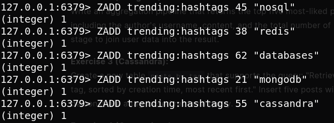

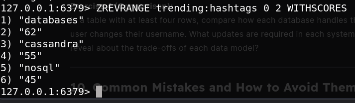

---

### 3.2 Part B: MongoDB — Document Social Media Model

#### 3.2.1 Connecting to MongoDB

MongoDB was accessed using the `mongosh` shell with authentication credentials:

```bash
docker exec -it mongo_social mongosh -u admin -p password123 --authenticationDatabase admin
```

```javascript
use social_media_db
```

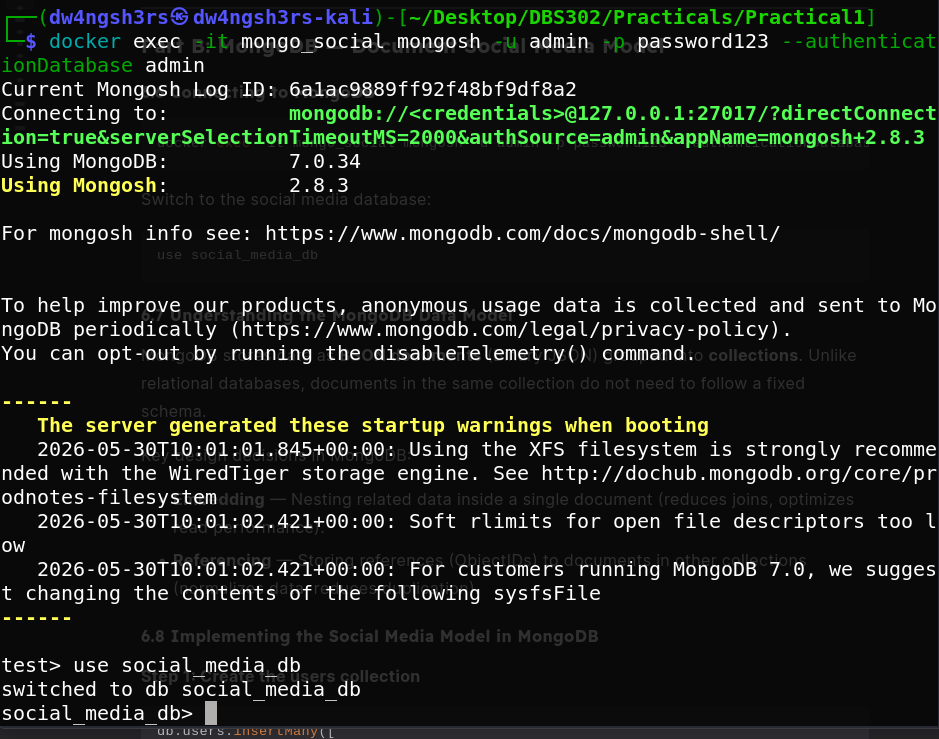

#### 3.2.2 Creating Users and Posts Collections

Three user documents and four post documents were inserted. The post documents used the **embedded design pattern**, nesting likes arrays and comment subdocuments directly within each post — avoiding the need for separate join tables:

```javascript
db.users.insertMany([
  { _id: "user_1001", username: "alice", name: "Alice Johnson", bio: "Software engineer and coffee lover.", joined: new Date("2024-01-15"), followers_count: 2, following_count: 1, following: ["user_1002", "user_1003"] },
  { _id: "user_1002", username: "bob",   name: "Bob Smith",     bio: "Tech enthusiast and open-source contributor.", joined: new Date("2024-02-20"), followers_count: 1, following_count: 1, following: ["user_1003"] },
  { _id: "user_1003", username: "carol", name: "Carol Williams", bio: "Designer and digital artist.", joined: new Date("2024-03-10"), followers_count: 2, following_count: 0, following: [] }
])
```


```javascript
db.posts.insertMany([
  { _id: "post_p001", user_id: "user_1001", username: "alice", content: "Just set up my NoSQL development environment. Redis is incredibly fast!", created_at: new Date("2025-05-01T10:00:00Z"), likes: [], comments: [], tags: ["redis", "nosql", "databases"] },
  { _id: "post_p002", user_id: "user_1001", username: "alice", content: "MongoDB's document model makes data modeling so intuitive.", created_at: new Date("2025-05-01T11:30:00Z"), likes: ["user_1002"], comments: [{ user_id: "user_1002", username: "bob", text: "Absolutely agree!", created_at: new Date("2025-05-01T12:00:00Z") }], tags: ["mongodb", "nosql", "datamodeling"] },
  { _id: "post_p003", user_id: "user_1002", username: "bob",   content: "Learning about CAP theorem today. Fascinating trade-offs in distributed systems.", created_at: new Date("2025-05-01T09:00:00Z"), likes: ["user_1001", "user_1003"], comments: [], tags: ["cap", "distributed-systems", "nosql"] },
  { _id: "post_p004", user_id: "user_1003", username: "carol", content: "Designed a new UI mockup for a social feed. Sharing soon!", created_at: new Date("2025-05-01T14:00:00Z"), likes: [], comments: [], tags: ["design", "ui", "ux"] }
])
```

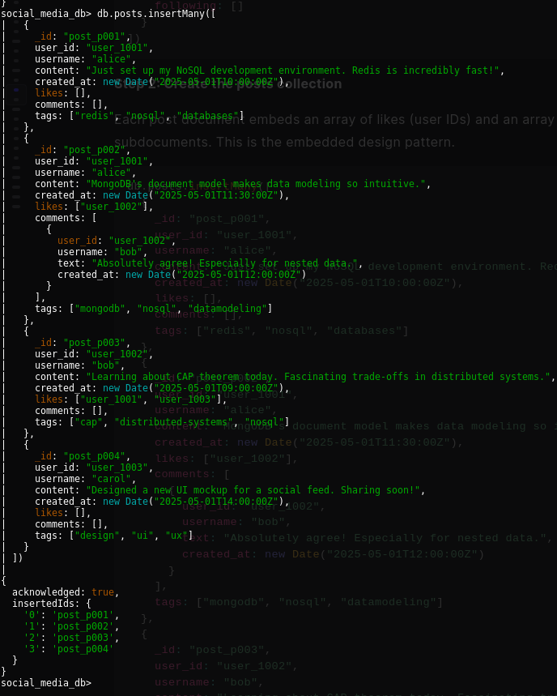

#### 3.2.3 Read Queries

```javascript
// All posts by Alice
db.posts.find({ user_id: "user_1001" }).pretty()

// Projection — content and date only
db.posts.find({ user_id: "user_1001" }, { content: 1, created_at: 1, _id: 0 })

// Posts tagged "nosql"
db.posts.find({ tags: "nosql" }).pretty()

// Posts with at least one like
db.posts.find({ "likes.0": { $exists: true } })
```

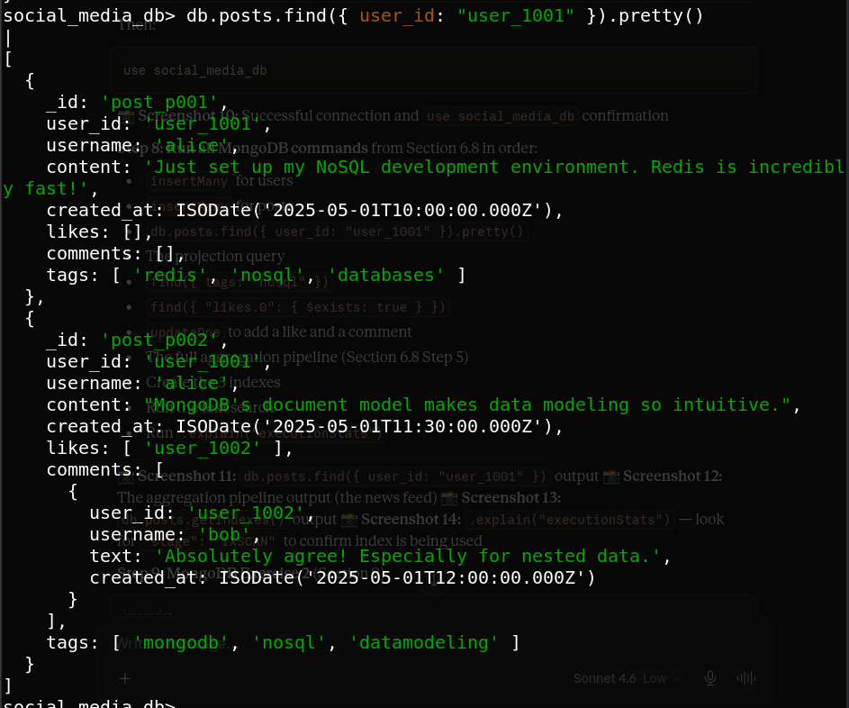

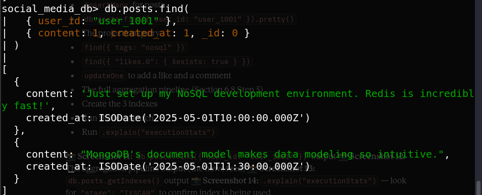

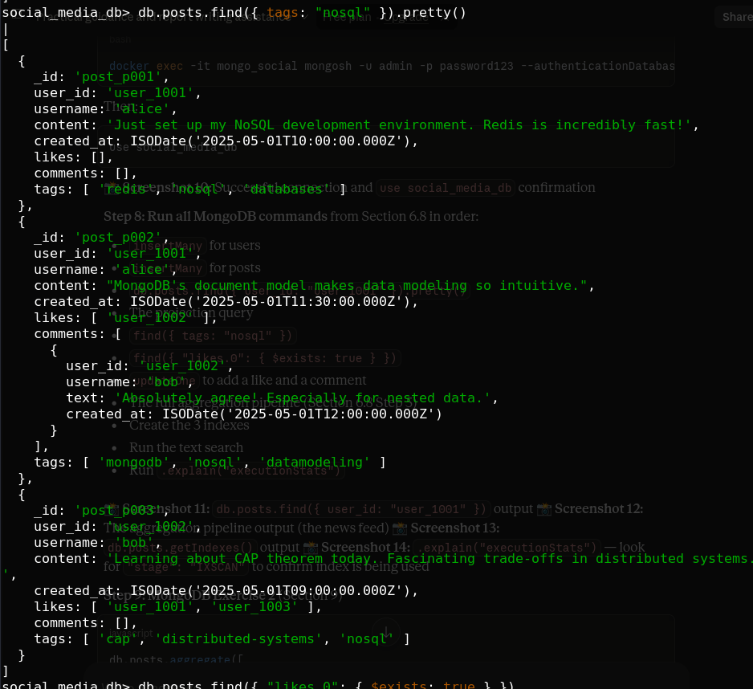

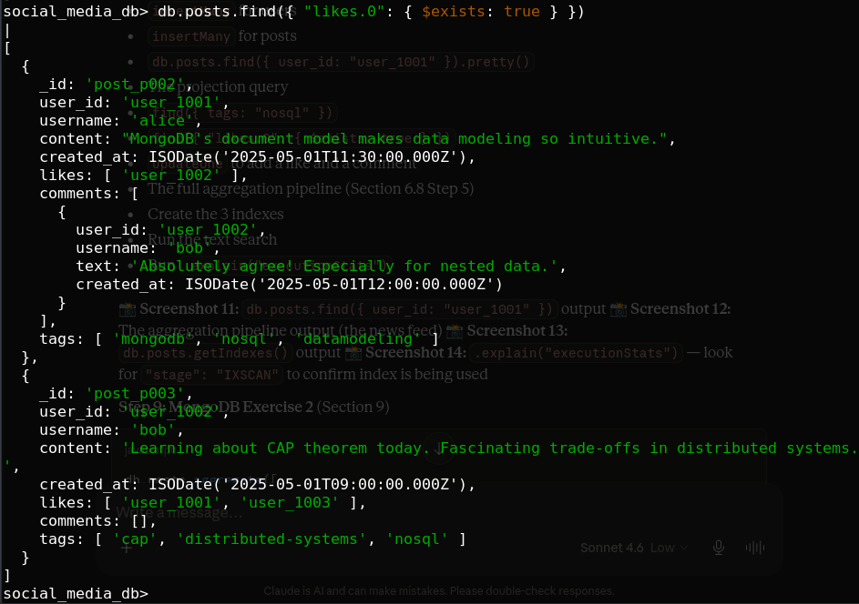

#### 3.2.4 Update Operations

```javascript
// Add a like and increment likes_count
db.posts.updateOne(
  { _id: "post_p001" },
  { $push: { likes: "user_1003" }, $inc: { likes_count: 1 } }
)

// Add a comment
db.posts.updateOne(
  { _id: "post_p001" },
  { $push: { comments: { user_id: "user_1003", username: "carol", text: "Great setup! Which OS are you using?", created_at: new Date() } } }
)
```


#### 3.2.5 Aggregation Pipeline — Social Feed

MongoDB's aggregation framework was used to build a chronological feed of posts from users that Alice follows, using `$match`, `$sort`, `$limit`, and `$project` stages:

```javascript
db.posts.aggregate([
  { $match: { user_id: { $in: ["user_1002", "user_1003"] } } },
  { $sort: { created_at: -1 } },
  { $limit: 10 },
  { $project: {
      username: 1,
      content: 1,
      created_at: 1,
      likes_count: { $size: { $ifNull: ["$likes", []] } },
      comments_count: { $size: { $ifNull: ["$comments", []] } }
  }}
])
```


#### 3.2.6 Indexes and Query Plans

Three indexes were created to support efficient querying:

```javascript
db.posts.createIndex({ user_id: 1 })
db.posts.createIndex({ user_id: 1, created_at: -1 })
db.posts.createIndex({ content: "text", tags: "text" })

// Full-text search
db.posts.find({ $text: { $search: "distributed systems" } })

// Verify indexes
db.posts.getIndexes()

// Explain query plan
db.posts.find({ user_id: "user_1001" }).explain("executionStats")
```

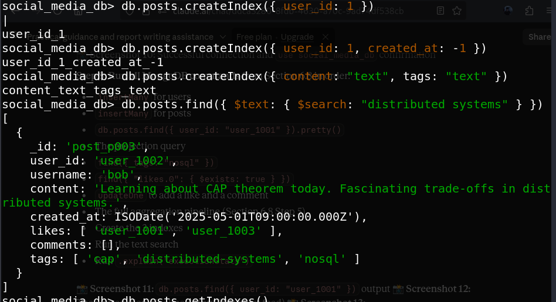


Explain aquery plan:

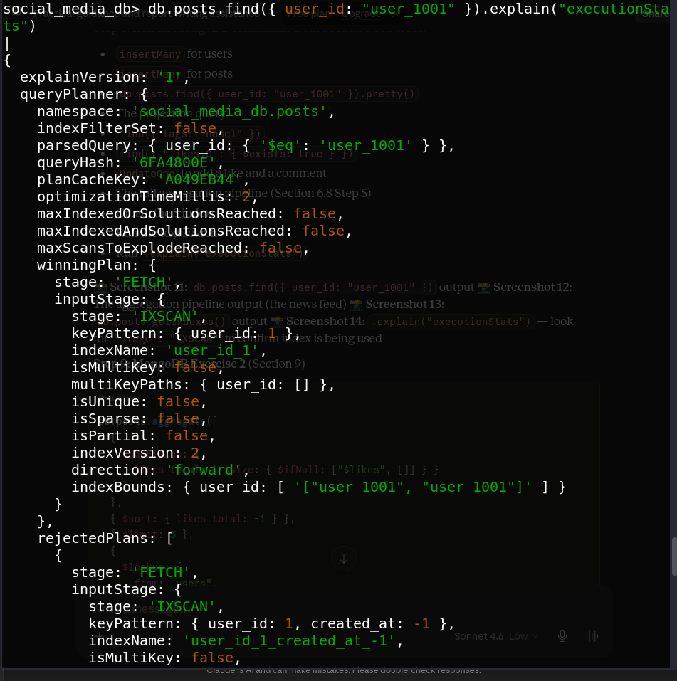

#### 3.2.7 Exercise 2 — Top 5 Most-Liked Posts with `$lookup`

An aggregation pipeline was written to return the top five most-liked posts, computing like counts dynamically with `$addFields` and `$size`, then joining user data with `$lookup`:

```javascript
db.posts.aggregate([
  { $addFields: { likes_total: { $size: { $ifNull: ["$likes", []] } } } },
  { $sort: { likes_total: -1 } },
  { $limit: 5 },
  { $lookup: { from: "users", localField: "user_id", foreignField: "_id", as: "author_info" } },
  { $project: { username: 1, content: 1, likes_total: 1 } }
])
```

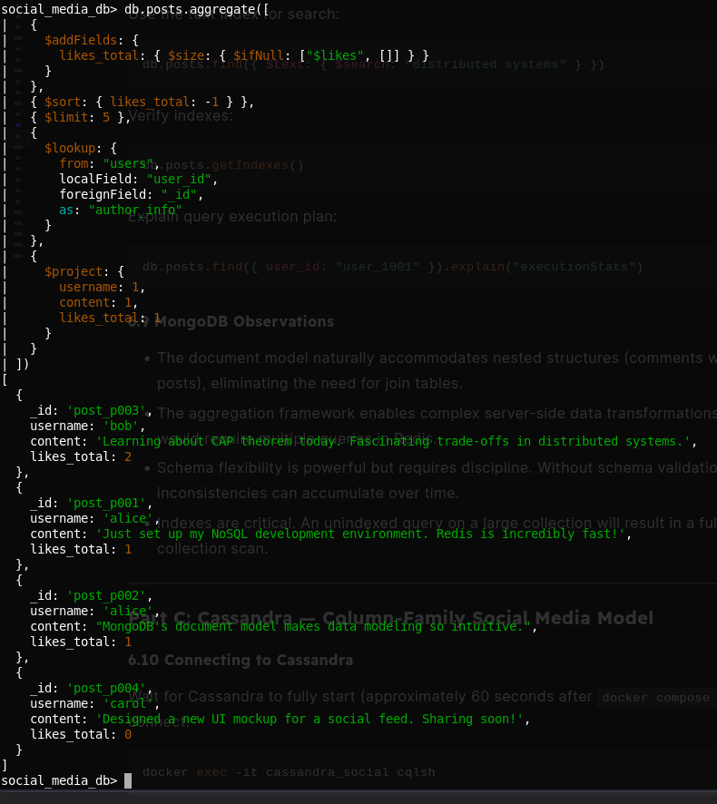

---

### 3.3 Part C: Cassandra — Column-Family Social Media Model

#### 3.3.1 Connecting to Cassandra

Cassandra was accessed using `cqlsh` after waiting approximately 60 seconds for the container to fully initialise:

```bash
docker exec -it cassandra_social cqlsh
```

```sql
DESCRIBE CLUSTER;
```

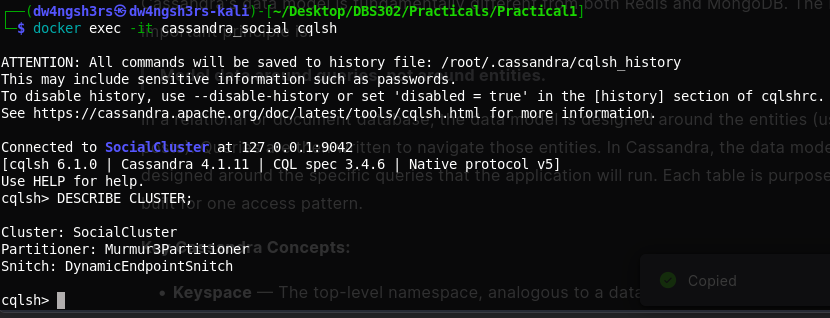

#### 3.3.2 Creating the Keyspace

```sql
CREATE KEYSPACE IF NOT EXISTS social_media
WITH replication = { 'class': 'SimpleStrategy', 'replication_factor': 1 };

USE social_media;
```

#### 3.3.3 Users Table

```sql
CREATE TABLE IF NOT EXISTS users (
    user_id  UUID,
    username TEXT,
    name     TEXT,
    bio      TEXT,
    joined   TIMESTAMP,
    PRIMARY KEY (user_id)
);

INSERT INTO users (user_id, username, name, bio, joined)
VALUES (11111111-1111-1111-1111-111111111111, 'alice', 'Alice Johnson', 'Software engineer and coffee lover.', '2024-01-15 00:00:00+0000');

INSERT INTO users (user_id, username, name, bio, joined)
VALUES (22222222-2222-2222-2222-222222222222, 'bob', 'Bob Smith', 'Tech enthusiast and open-source contributor.', '2024-02-20 00:00:00+0000');

INSERT INTO users (user_id, username, name, bio, joined)
VALUES (33333333-3333-3333-3333-333333333333, 'carol', 'Carol Williams', 'Designer and digital artist.', '2024-03-10 00:00:00+0000');
```

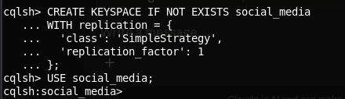

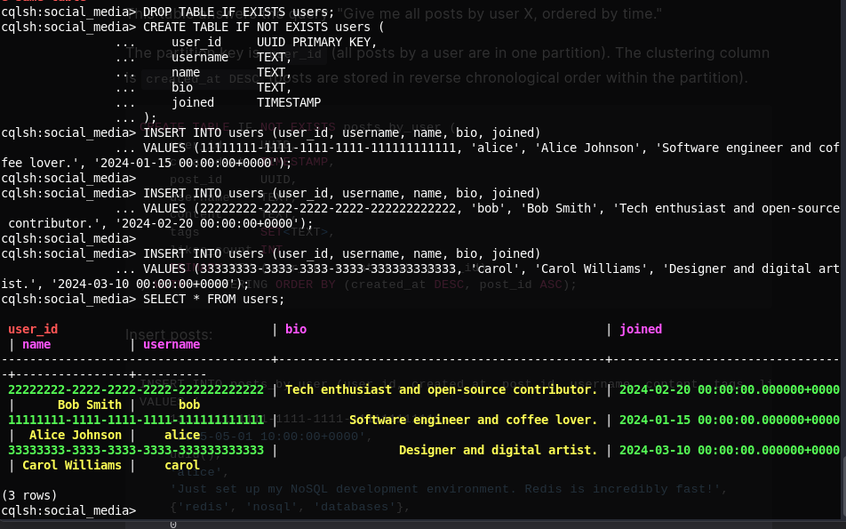

#### 3.3.4 Posts by User (Query-Driven Table Design)

This table was designed specifically to answer: *"Give me all posts by user X, sorted by time."* The partition key is `user_id` and clustering columns are `(created_at DESC, post_id ASC)`, pre-sorting results within each partition:

```sql
CREATE TABLE IF NOT EXISTS posts_by_user (
    user_id     UUID,
    created_at  TIMESTAMP,
    post_id     UUID,
    username    TEXT,
    content     TEXT,
    tags        SET<TEXT>,
    likes_count INT,
    PRIMARY KEY (user_id, created_at, post_id)
) WITH CLUSTERING ORDER BY (created_at DESC, post_id ASC);

INSERT INTO posts_by_user (user_id, created_at, post_id, username, content, tags, likes_count)
VALUES (11111111-1111-1111-1111-111111111111, '2025-05-01 10:00:00+0000', uuid(), 'alice', 'Just set up my NoSQL development environment. Redis is incredibly fast!', {'redis', 'nosql', 'databases'}, 0);

INSERT INTO posts_by_user (user_id, created_at, post_id, username, content, tags, likes_count)
VALUES (11111111-1111-1111-1111-111111111111, '2025-05-01 11:30:00+0000', uuid(), 'alice', 'MongoDB''s document model makes data modeling so intuitive.', {'mongodb', 'nosql', 'datamodeling'}, 1);

INSERT INTO posts_by_user (user_id, created_at, post_id, username, content, tags, likes_count)
VALUES (22222222-2222-2222-2222-222222222222, '2025-05-01 09:00:00+0000', uuid(), 'bob', 'Learning about CAP theorem today. Fascinating trade-offs in distributed systems.', {'cap', 'distributed-systems', 'nosql'}, 2);
```

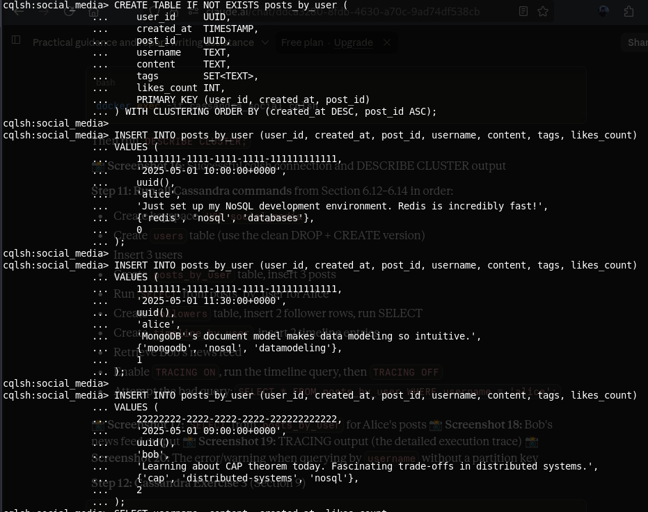

```sql
-- Retrieve Alice's posts
SELECT username, content, created_at, likes_count
FROM posts_by_user
WHERE user_id = 11111111-1111-1111-1111-111111111111;
```


#### 3.3.5 Followers Table

```sql
CREATE TABLE IF NOT EXISTS followers (
    user_id           UUID,
    follower_id       UUID,
    follower_username TEXT,
    followed_at       TIMESTAMP,
    PRIMARY KEY (user_id, follower_id)
);

INSERT INTO followers (user_id, follower_id, follower_username, followed_at)
VALUES (11111111-1111-1111-1111-111111111111, 22222222-2222-2222-2222-222222222222, 'bob', toTimestamp(now()));

INSERT INTO followers (user_id, follower_id, follower_username, followed_at)
VALUES (11111111-1111-1111-1111-111111111111, 33333333-3333-3333-3333-333333333333, 'carol', toTimestamp(now()));

SELECT follower_username, followed_at FROM followers
WHERE user_id = 11111111-1111-1111-1111-111111111111;
```

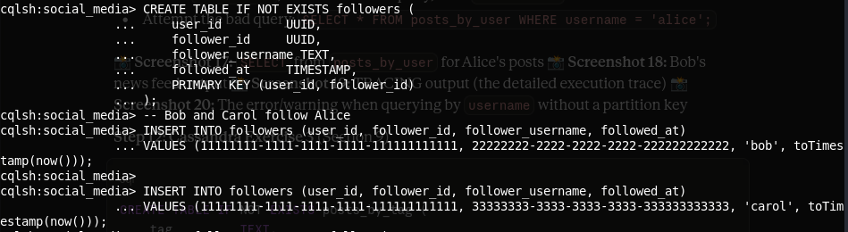


#### 3.3.6 Timeline (Fan-Out on Write)

This table implements the **fan-out-on-write** pattern: when a user posts, the content is duplicated into each follower's timeline partition at write time, enabling fast single-partition reads:

```sql
CREATE TABLE IF NOT EXISTS timeline_by_user (
    user_id     UUID,
    created_at  TIMESTAMP,
    post_id     UUID,
    author_id   UUID,
    author_name TEXT,
    content     TEXT,
    likes_count INT,
    PRIMARY KEY (user_id, created_at, post_id)
) WITH CLUSTERING ORDER BY (created_at DESC, post_id ASC);

-- Alice's post written into Bob's timeline
INSERT INTO timeline_by_user (user_id, created_at, post_id, author_id, author_name, content, likes_count)
VALUES (22222222-2222-2222-2222-222222222222, '2025-05-01 10:00:00+0000', uuid(), 11111111-1111-1111-1111-111111111111, 'alice', 'Just set up my NoSQL development environment. Redis is incredibly fast!', 0);

-- Alice's post also written into Carol's timeline
INSERT INTO timeline_by_user (user_id, created_at, post_id, author_id, author_name, content, likes_count)
VALUES (33333333-3333-3333-3333-333333333333, '2025-05-01 10:00:00+0000', uuid(), 11111111-1111-1111-1111-111111111111, 'alice', 'Just set up my NoSQL development environment. Redis is incredibly fast!', 0);
```

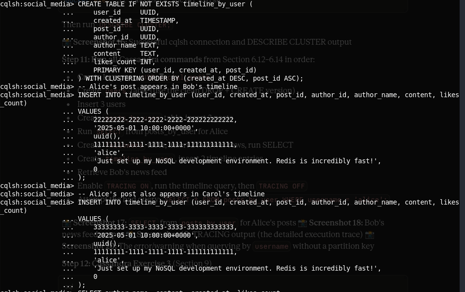

```sql
-- Retrieve Bob's news feed
SELECT author_name, content, created_at, likes_count
FROM timeline_by_user
WHERE user_id = 22222222-2222-2222-2222-222222222222
LIMIT 20;
```

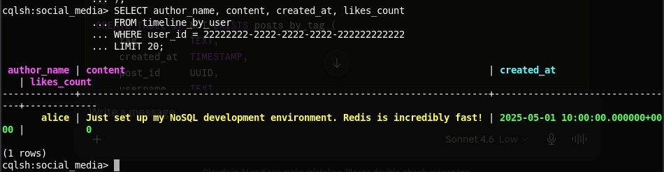

#### 3.3.7 Query Tracing

Cassandra's built-in tracing feature was enabled to inspect per-node execution steps and microsecond timings:

```sql
TRACING ON;

SELECT author_name, content, created_at
FROM timeline_by_user
WHERE user_id = 22222222-2222-2222-2222-222222222222
LIMIT 10;

TRACING OFF;
```

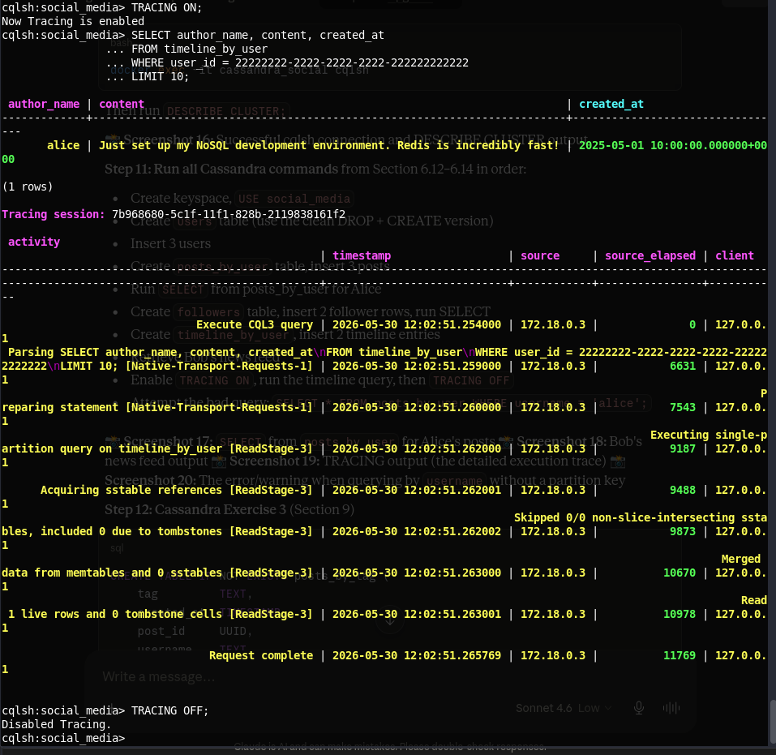

#### 3.3.8 Non-Partition Key Query Restriction

An attempt was made to query `posts_by_user` by `username`, which is not a partition key. Cassandra rejected the query, demonstrating the core constraint that Cassandra can only filter efficiently on partition keys and clustering columns:

```sql
SELECT * FROM posts_by_user WHERE username = 'alice';
```

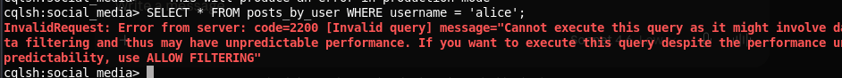

#### 3.3.9 Exercise 3 — Posts by Tag Table

A `posts_by_tag` table was created to support: *"Retrieve all posts with a given tag, sorted by most recent first."* The partition key is `tag` and the clustering column is `created_at DESC`:

```sql
CREATE TABLE IF NOT EXISTS posts_by_tag (
    tag        TEXT,
    created_at TIMESTAMP,
    post_id    UUID,
    username   TEXT,
    content    TEXT,
    PRIMARY KEY (tag, created_at, post_id)
) WITH CLUSTERING ORDER BY (created_at DESC, post_id ASC);

INSERT INTO posts_by_tag (tag, created_at, post_id, username, content)
VALUES ('nosql', '2025-05-01 10:00:00+0000', uuid(), 'alice', 'Redis is incredibly fast!');

INSERT INTO posts_by_tag (tag, created_at, post_id, username, content)
VALUES ('nosql', '2025-05-01 11:30:00+0000', uuid(), 'alice', 'MongoDB document model is intuitive.');

INSERT INTO posts_by_tag (tag, created_at, post_id, username, content)
VALUES ('nosql', '2025-05-01 09:00:00+0000', uuid(), 'bob', 'CAP theorem trade-offs are fascinating.');

INSERT INTO posts_by_tag (tag, created_at, post_id, username, content)
VALUES ('databases', '2025-05-01 08:00:00+0000', uuid(), 'carol', 'Comparing SQL vs NoSQL today.');

INSERT INTO posts_by_tag (tag, created_at, post_id, username, content)
VALUES ('databases', '2025-05-01 12:00:00+0000', uuid(), 'bob', 'Cassandra scales linearly!');

-- Retrieve all nosql-tagged posts
SELECT username, content, created_at FROM posts_by_tag WHERE tag = 'nosql';
```

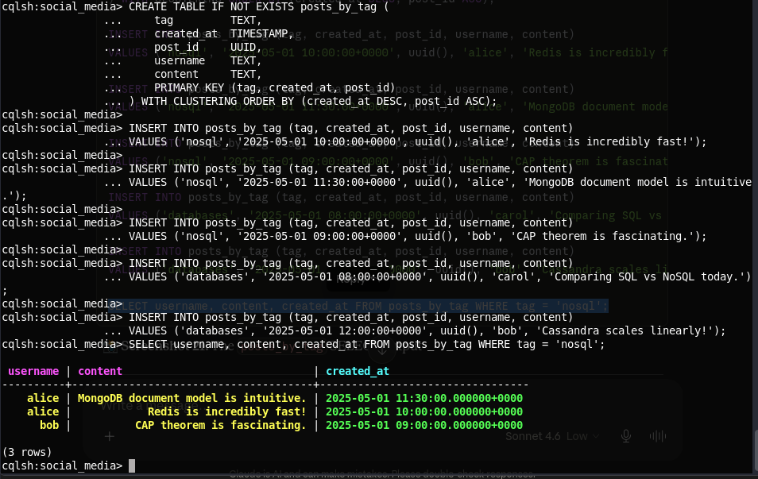

---

## 4. Benchmark Results

The Python benchmarking script was executed to measure write and read performance across all three databases for 500 records. The script used pipelining for Redis, `insert_many` for MongoDB, and prepared statements for Cassandra.

```bash
pip install redis pymongo cassandra-driver
python benchmark.py
```

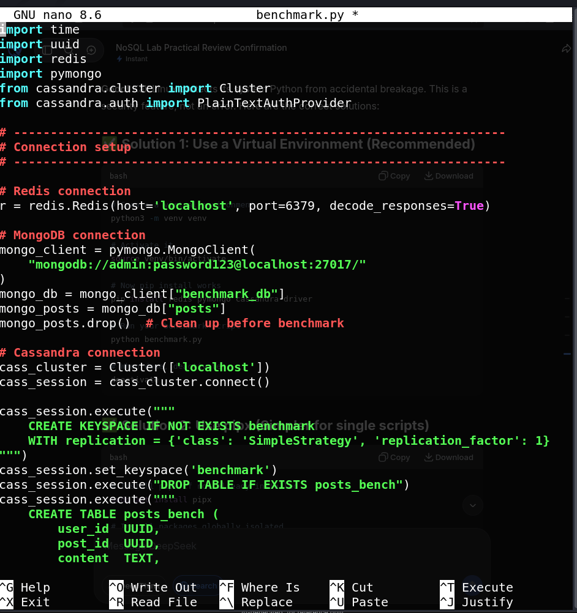


### 4.1 Interpretation of Results

| Operation | Redis | MongoDB | Cassandra |
|---|---|---|---|
| Write (500 records) | Fastest — in-memory, no disk I/O | Moderate — buffered write model | Slower (single node) — much faster at cluster scale |
| Read (500 records) | Two-step pipeline (IDs then content) | Very fast with compound index | Fast — single partition scan |

**Redis** demonstrated the highest write throughput due to its in-memory architecture. All data is written directly to RAM, with no synchronous disk I/O overhead.

**MongoDB** performed competitively for reads because the compound index on `(user_id, created_at)` allowed the engine to locate all relevant documents in a single B-tree traversal.

**Cassandra's** write performance appears lower on a single-node local setup, but this is misleading. In a multi-node production cluster, Cassandra's log-structured merge-tree (LSM) storage engine enables write throughput that surpasses both Redis and MongoDB at scale, as writes are appended sequentially to an in-memory memtable with no locking.

---

## 5. Comparison Table

### 5.1 Data Modelling Philosophy

| Aspect | Redis | MongoDB | Cassandra |
|---|---|---|---|
| Data Organisation | Flat key-value pairs with typed value structures | Nested BSON documents in collections | Partitioned rows with clustering columns |
| Schema Enforcement | None — developer maintains key naming conventions | Optional via schema validator rules | Strict DDL required before data insertion |
| Relationship Modelling | Manual via separate keys (e.g. `following:1001`) | Embedding or referencing (ObjectIDs) | Denormalisation — data duplicated across tables |
| Query Design Approach | Application-driven, multi-step client logic | Entity-driven — model entities, then query | Query-driven — design tables around queries first |
| Nested Data Handling | Multiple separate keys required | Native subdocument embedding (e.g. `comments[]`) | Collections: `SET`, `LIST`, `MAP` column types |

### 5.2 Query Syntax Comparison: Retrieve 10 Most Recent Posts for a User

| Database | Command / Query | Notes |
|---|---|---|
| **Redis** | `LRANGE timeline:1001 0 9` | Returns IDs only — second round-trip needed to fetch content |
| **MongoDB** | `db.posts.find({user_id:"user_1001"}).sort({created_at:-1}).limit(10)` | Full documents returned in a single query |
| **Cassandra** | `SELECT * FROM posts_by_user WHERE user_id = ... LIMIT 10;` | Pre-sorted by partition; single efficient read |

### 5.3 Performance Characteristics

| Characteristic | Redis | MongoDB | Cassandra |
|---|---|---|---|
| Read Latency (single object) | Sub-millisecond | 1–10 ms | 1–5 ms |
| Write Throughput | Very High (in-memory) | High | Extremely High (at cluster scale) |
| Data Persistence | Optional (RDB/AOF snapshots) | Always on disk | Always on disk (LSM tree) |
| Horizontal Scalability | Redis Cluster (sharding) | Sharding | Linear — add nodes seamlessly |
| Flexible Ad-hoc Queries | Very Limited | Excellent | Very Limited |
| Schema Flexibility | None | High (flexible documents) | Low (strict, query-driven DDL) |
| Memory Footprint | High (all data in RAM) | Moderate | Low (disk-based) |

### 5.4 Exercise 4 — Username Change Scenario

The table below analyses what is required when a user changes their username in each database, revealing key trade-offs of each data model:

| Database | Updates Required | Trade-off Revealed |
|---|---|---|
| **Redis** | Update `HSET user:{id} username` field. No other keys affected if username is not embedded in key names. | Clean when data is namespaced by ID. However, if username was ever used in key names, all such keys must be manually renamed — Redis has no cascading update mechanism. |
| **MongoDB** | Update the `users` document. Also update the `username` field denormalised into all `posts` documents via `updateMany` where `user_id` matches. | Embedded `username` in post documents creates data redundancy. A single username change may require updating thousands of post documents — this is the cost of denormalisation. |
| **Cassandra** | Every table containing `username` (`posts_by_user`, `timeline_by_user`, `followers`) must be updated. Some updates require deleting and re-inserting rows because primary key components cannot be updated in place. | Cassandra's query-driven denormalisation maximises read performance but makes updates to mutable fields very expensive. Fields like `username` should ideally be resolved at read time rather than duplicated. |

---

## 6. Summary Analysis

### 6.1 Key Lessons Learned

This practical demonstrated that **NoSQL is not a single technology** but a family of specialised systems, each making deliberate trade-offs to optimise for different workloads and access patterns.

The most important lesson from **Redis** was that speed comes from simplicity. By keeping all data in memory and providing a small set of primitive data structures, Redis achieves sub-millisecond performance. However, anything beyond key lookups — such as building a news feed from posts across multiple users — requires multiple round trips or client-side logic. Redis excels as a caching layer or for atomic counters and session storage, not as a primary store for complex social data.

**MongoDB** revealed the power and risk of schema flexibility. Embedding comments directly inside post documents made reads extremely efficient — a single document retrieval returns a post and all its comments with no joins required. The aggregation pipeline provided SQL-like analytical power without leaving the database layer. However, the username change exercise demonstrated that denormalisation creates update anomalies: a single logical change can require updating thousands of documents. Without disciplined schema design and indexing, MongoDB performance degrades rapidly.

**Cassandra's** query-driven design philosophy was the most counterintuitive but ultimately the most insightful lesson. The principle that *the schema is the query plan* forces developers to think carefully about access patterns before writing any code. The fan-out-on-write pattern for timelines — where a post is written into every follower's timeline partition at write time — trades write amplification for extremely fast, predictable reads. The tracing output confirmed that timeline reads are single-partition operations, requiring no cross-node coordination.

### 6.2 Database Selection Recommendation

For a real-world social media platform at scale, no single database is the ideal choice in isolation. A **polyglot persistence architecture** would be most effective:

- **Redis** — Caching layer for pre-computed feeds, session tokens, and trending hashtag counters, leveraging its in-memory speed for the most frequently accessed data.
- **MongoDB** — Primary store for user profiles, post content, and metadata, providing flexible schema evolution as product requirements change and supporting ad-hoc analytics.
- **Cassandra** — Timeline and notification systems at scale, using the fan-out-on-write pattern to ensure that even with millions of followers, a user's news feed is always a fast single-partition read.

If forced to choose a **single database**, **MongoDB** would be most appropriate for a startup or medium-scale platform because it provides the best balance of query flexibility, developer productivity, and adequate performance. **Cassandra** would become the preferred choice as the platform scales to tens of millions of users and write throughput becomes the dominant bottleneck.

---

## 7. References

- Redis Documentation. (2024). *Redis data types*. https://redis.io/docs/data-types/
- MongoDB Documentation. (2024). *Aggregation pipeline*. https://www.mongodb.com/docs/manual/core/aggregation-pipeline/
- Apache Cassandra Documentation. (2024). *Data modelling*. https://cassandra.apache.org/doc/latest/cassandra/data_modeling/
- Brewer, E. (2000). Towards robust distributed systems. 
- DBS302 Practical 1 Lab Sheet. *Setting Up Redis, MongoDB, and Cassandra — Implementing a Social Media Data Model and Contrasting Query Patterns*.